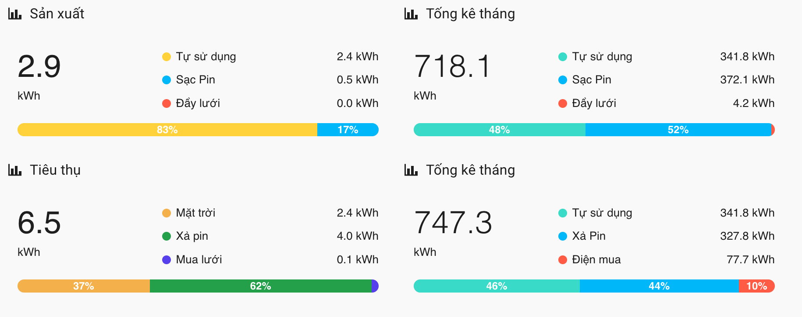
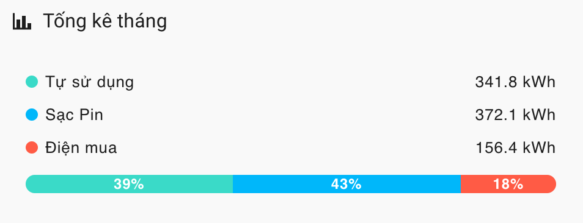

# 📊 energy-bar-card

Custom card cho Home Assistant hiển thị **tổng năng lượng và tỉ lệ các thành phần** (như năng lượng mặt trời, lưới, pin, tải...) dưới dạng thanh màu trực quan.




---

## ⚡ Tính năng chính

- Hiển thị tổng công suất và tỉ lệ phần trăm của từng thực thể
- Thanh màu biểu diễn tỷ lệ phần trăm đẹp, gọn gàng
- Tùy chỉnh màu, tên, đơn vị, font
- Tự động lấy tên thực thể nếu không khai báo
- Hỗ trợ `dark mode`
- Giao diện responsive, dễ tích hợp Lovelace

---

## 🛠️ Cấu hình mẫu

```yaml
type: custom:energy-bar-card
bar_height: 28
total_font_size: 36
font_weight_total: bold
decimal_precision: true
show_total: true
entities:
  - entity_id: sensor.solar_power
    name: Quang điện
    color: "#f9d923"
  - entity_id: sensor.grid_power
    name: Lưới
    color: "#3c8dbc"
  - entity_id: sensor.battery_power
    name: Pin
    color: "#32a852"
  - entity_id: sensor.load_power
    name: Tải
    color: "#e74c3c"
```
## Tùy chọn cấu hình

| Tùy chọn            | Mặc định | Mô tả                                   |
| ------------------- | -------- | --------------------------------------- |
| `bar_height`        | 24       | Chiều cao thanh bar (px)                |
| `total_font_size`   | 32       | Cỡ chữ phần tổng                        |
| `font_weight_total` | bold     | Độ đậm chữ tổng (normal, bold...)       |
| `decimal_precision` | true     | Hiển thị số thập phân                   |
| `show_total`        | true     | Có hiển thị tổng không                  |
| `entities`          | \[]      | Danh sách các thực thể nguồn năng lượng |

# Ủng hộ tôi để có thêm động lực phát triển:
https://bachtran.net/donate/
Cảm ơn các bạn

